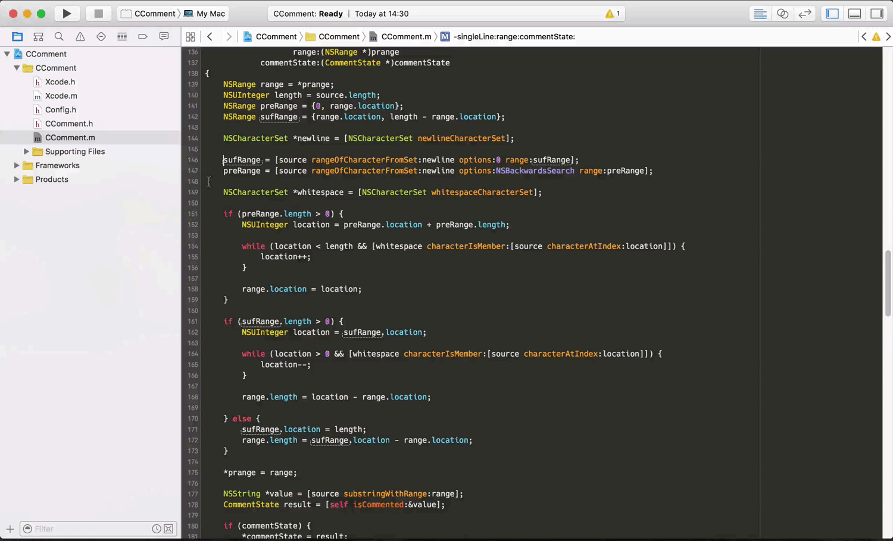

Xcode-CComment
========

Xcode plugin for C Style Comment(uncomment) /**/

Features:
---------
- single line comment(uncomment)
- selection comment(uncomment)
- default key shortcut ^⌘/(control+command+/)

How To Use:
-----------
- build, or copy to ~/Library/Application\ Support/Developer/Shared/Xcode/Plug-ins，and restart Xcode
- Menu->Edit->Comment, CMD+CTRL+/ for shortcut, compile to customise
- Build error? Copy CComment.xcplugin in Plugin to Xcode Plug-ins dir first to promote permission

How To Fix DIY:
-----------
-  get Xcode(new version) UUID
   `defaults read /Applications/Xcode.app/Contents/Info DVTPlugInCompatibilityUUID`   
- add UUID to DVTPlugInCompatibilityUUIDs in file
  ~/Library/Application Support/Developer/Shared/Xcode/Plug-ins/CComment.xcplugin/Contents/Info.plist
- restart Xcode

Snapshot:
---------

License
-------

Xcode-CComment is available under the MIT license. See the LICENSE file for more info.
